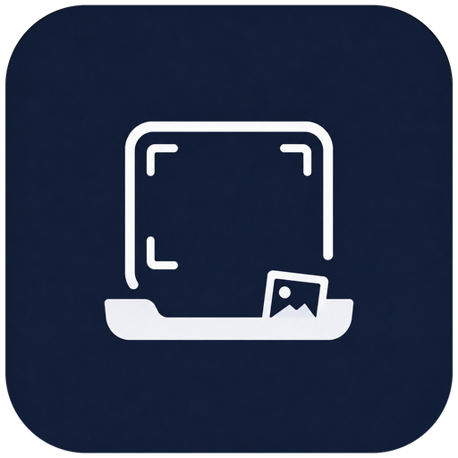
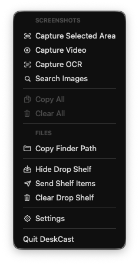
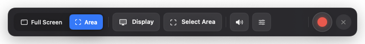
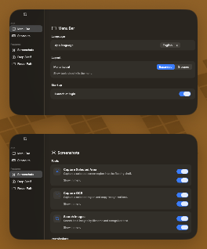
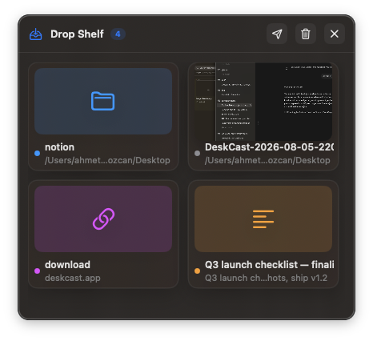
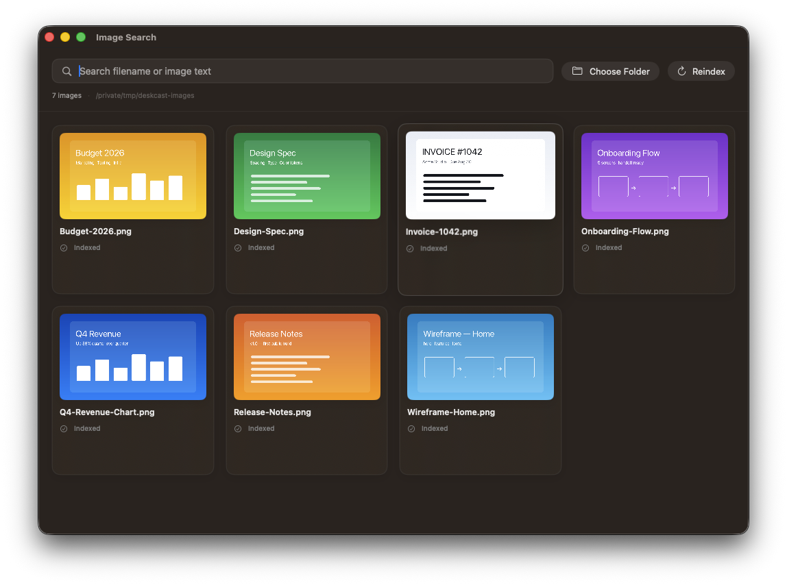
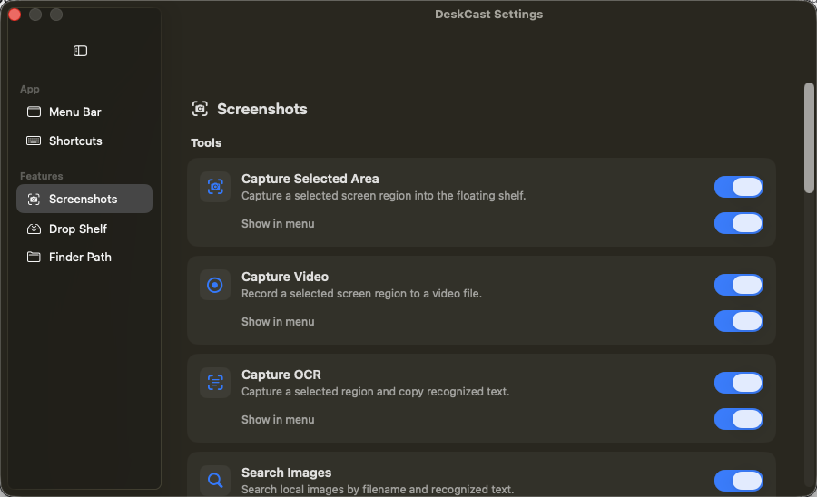

<div align="center">



# DeskCast

**A lightweight macOS menu-bar toolbox for everyday desktop work.**
Capture, collect, and search — without a Dock icon getting in your way.

[](https://github.com/ahmetbugraozcan/macos-toolbox/releases/latest)
[](LICENSE)
[](https://github.com/ahmetbugraozcan/macos-toolbox/releases/latest/download/DeskCast.dmg)

<br/>



</div>

---

DeskCast lives quietly in the menu bar and bundles a handful of focused, keyboard-
and drag-friendly tools. Every tool can be toggled and shown or hidden in the menu,
and the entire UI is localized in **English and Turkish**.

## Features

### 🎬 Screen recording

Record the **full display** or a **resizable selected area** to a video file, with
optional system audio and microphone. A clean floating controller lets you pick the
mode, quality (bitrate), codec (H.264/HEVC), frame rate and an optional 3-2-1
countdown; a live outline shows exactly which region is being captured. Finished
videos land in the same shelf as your screenshots.

<div align="center"></div>

### 📸 Screenshot shelf

Capture a screen region into a floating shelf, then reorder, pin, copy, drag out to
other apps, save (or auto-save), and reveal in Finder — all without breaking your flow.

<div align="center"></div>

### 🗂️ Drop shelf

A floating tray that collects dragged **files, folders, links, text, and images** so
you can gather things from everywhere and send them somewhere together. Each item is
tinted by kind, and it opens on a shake while you're dragging content.

<div align="center"></div>

### 🔎 Image text search

Index a folder and search your local images by **filename and recognized text**
(Vision OCR) — great for finding that one screenshot with the right words in it.

<div align="center"></div>

### 📋 Copy Finder path & OCR

Copy the front Finder window's path to the clipboard, or capture a region and copy the
**recognized text** straight to your pasteboard.

## Download & install

1. Grab the latest notarized build:
   **[Download DeskCast.dmg](https://github.com/ahmetbugraozcan/macos-toolbox/releases/latest/download/DeskCast.dmg)**
2. Open the `.dmg` and drag **DeskCast** onto **Applications**.
3. Launch it — DeskCast appears in the menu bar (there is no Dock icon).

The app is signed with a Developer ID certificate and notarized by Apple, so it opens
cleanly on any Mac — no Gatekeeper workarounds needed.

<div align="center"></div>

## Build from source

```bash
xcodebuild -project screenshotapp.xcodeproj -scheme screenshotapp -configuration Debug -destination 'platform=macOS' build
```

Or open `screenshotapp.xcodeproj` in Xcode and run the `screenshotapp` scheme. Run the
tests with:

```bash
xcodebuild -project screenshotapp.xcodeproj -scheme screenshotapp -destination 'platform=macOS' test
```

**Requirements:** macOS (Apple Silicon or Intel) and Xcode with a matching macOS SDK.
The deployment target is set in `screenshotapp.xcodeproj`.

## Permissions

DeskCast asks for standard macOS permissions only when a feature needs them: **Screen
Recording** (capture / OCR / video), **Microphone** (optional recording audio),
**Automation → Finder** (copy path), and **Accessibility** (shake-to-open). It is
distributed outside the Mac App Store (Developer ID / notarized), so it is not sandboxed.

## Architecture

DeskCast is a SwiftUI + AppKit app organized as a layered, feature-module MVVM codebase:

```
screenshotapp/
  App/       @main app, AppDelegate, AppEnvironment (composition root / DI)
  Core/      cross-cutting: localization, shared UI, support helpers, ShelfCollecting
  Features/  ScreenshotShelf · ScreenRecording · DropShelf · ImageSearch ·
             Permissions · Settings · Toolbox
             each split into Model / ViewModel / View / Service / Presentation
```

- **View models** (`*ViewModel`) are `@MainActor ObservableObject`s that hold state and
  orchestrate services. They depend on **protocols**, not concrete services.
- **Services** wrap OS integrations (screen capture, ScreenCaptureKit recording, Vision
  OCR, export, Finder) behind protocols so they can be faked in tests.
- **`AppEnvironment`** is the composition root: it builds the view models, injects their
  dependencies, and owns the presentation coordinators — no singletons.
- **Presentation coordinators** own the AppKit `NSPanel` lifecycle; view models drive
  them through `*Presenting` protocols instead of touching AppKit directly.

See [CLAUDE.md](CLAUDE.md) and [AGENTS.md](AGENTS.md) for deeper notes.

## Contributing

Contributions are welcome — see [CONTRIBUTING.md](CONTRIBUTING.md).

## License

[MIT](LICENSE) © 2026 Ahmet Buğra Özcan
