<div align="center">

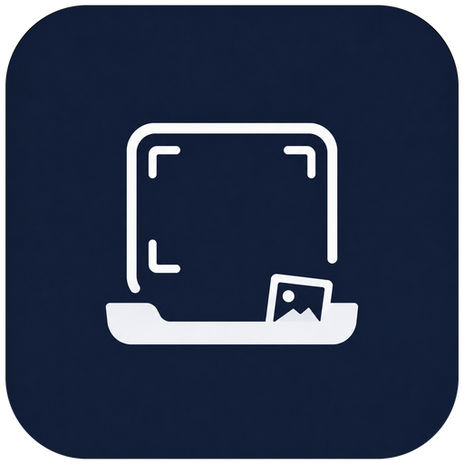

# DeskCast

**A lightweight macOS menu-bar toolbox for everyday desktop work.**
Capture, record, annotate, collect, and search — plus a Dynamic Island for your notch.

[](https://github.com/ahmetbugraozcan/DeskCast/releases/latest)
[](LICENSE)
[](https://github.com/ahmetbugraozcan/DeskCast/releases/latest/download/DeskCast.dmg)

<br/>

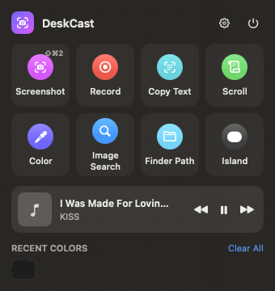

</div>

---

DeskCast lives quietly in the menu bar (no Dock icon) and bundles a set of focused,
keyboard- and drag-friendly tools behind one panel: tool tiles, what's playing, recent
captures and colors. Every tool can be turned off or hidden from the menu, and the
entire UI is localized in **English and Turkish**.

## Features

### 🏝️ Dynamic Island

A notch-anchored island that expands on hover. When closed, it shows what's going on:
the playing song (Music, Spotify, browser video), a running timer, or a **Claude Code /
Codex agent that is working** — with a banner when a long turn finishes. It also
mirrors other apps' notifications, DeskCast confirmations, battery alerts and
upcoming meetings (with a Join button).

<div align="center">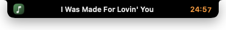</div>

Open it for media controls with synced lyrics, or pick one of 17 panels from the
launcher: per-app **volume mixer**, AI agent usage, clipboard history, system stats,
calendar, timer & stopwatch, camera mirror, downloads, scratchpad, Bluetooth device
batteries (AirPods included), weather and more. Panels can be reordered and hidden
right in the island.

<div align="center">
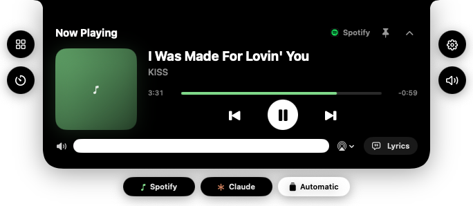
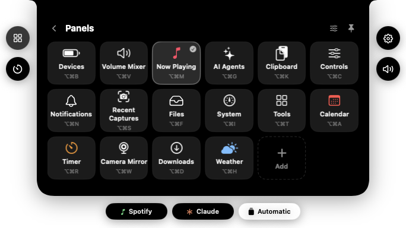
</div>

### 📸 Screenshots, annotation & pinning

Capture a screen region into a floating shelf, then reorder, copy, drag out to other
apps, save (or auto-save), and reveal in Finder. **Annotate** a capture with arrows,
rectangles, pen, text, highlight and pixelate, or **pin** it on screen as an
always-on-top panel.

<div align="center">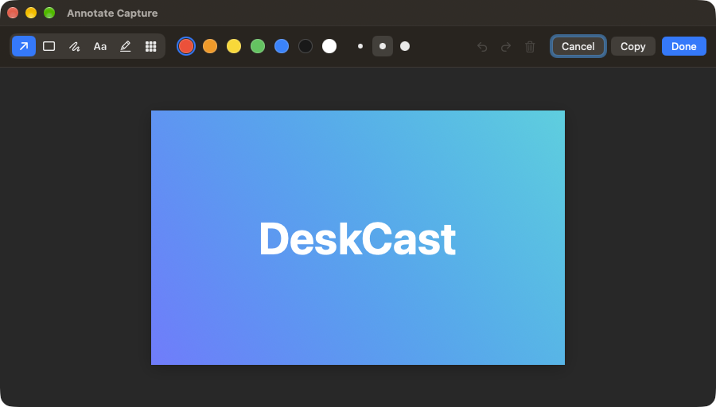</div>

### 📜 Scrolling capture

Select an area and scroll it yourself — DeskCast stitches the frames into one tall
image, skipping fixed headers and footers.

### 🎬 Screen recording, trim & GIF

Record the **full display** or a **resizable selected area**, with optional system
audio and microphone. A floating controller picks quality, codec (H.264/HEVC), frame
rate and a 3-2-1 countdown. Finished videos join the same shelf, where you can **trim**
them or turn them into a looping **GIF** — the original is never overwritten.

<div align="center">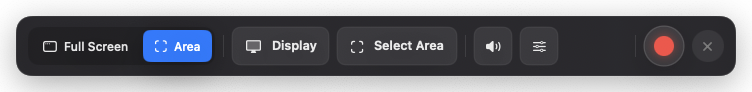</div>
<div align="center">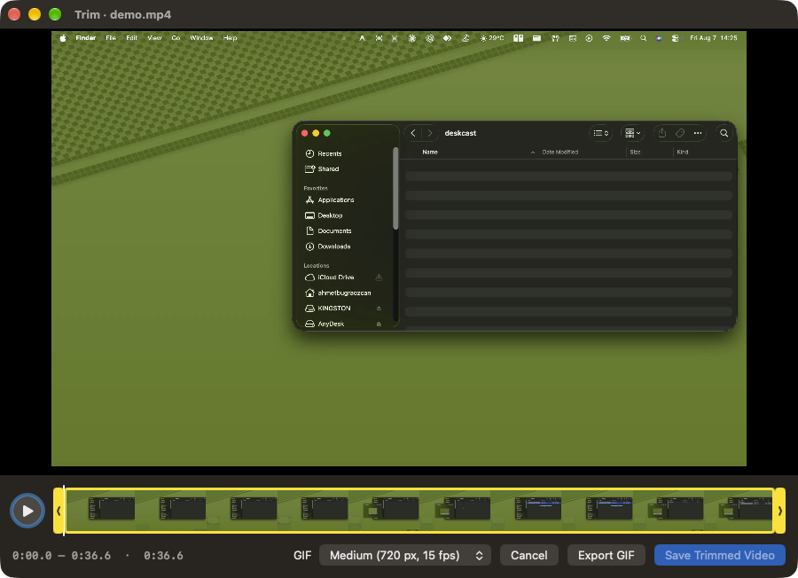</div>

### 🔤 Text, QR codes & colors

Capture a region to copy its **recognized text** or the contents of **QR codes and
barcodes** (Vision). **Pick a color** anywhere on screen with the system loupe and copy
it as HEX, RGB, HSL or SwiftUI; recent colors stay in the menu.

### 🗂️ Drop shelf

A floating tray that collects dragged **files, folders, links, text, and images** so
you can gather things from everywhere and send them somewhere together. It opens on a
shake while you're dragging.

<div align="center">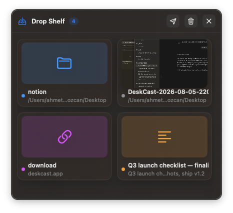</div>

### 🔎 Image text search & Finder path

Index a folder and search your local images by **filename and recognized text** — great
for finding that one screenshot with the right words in it. Copy the front Finder
window's path with one click.

<div align="center">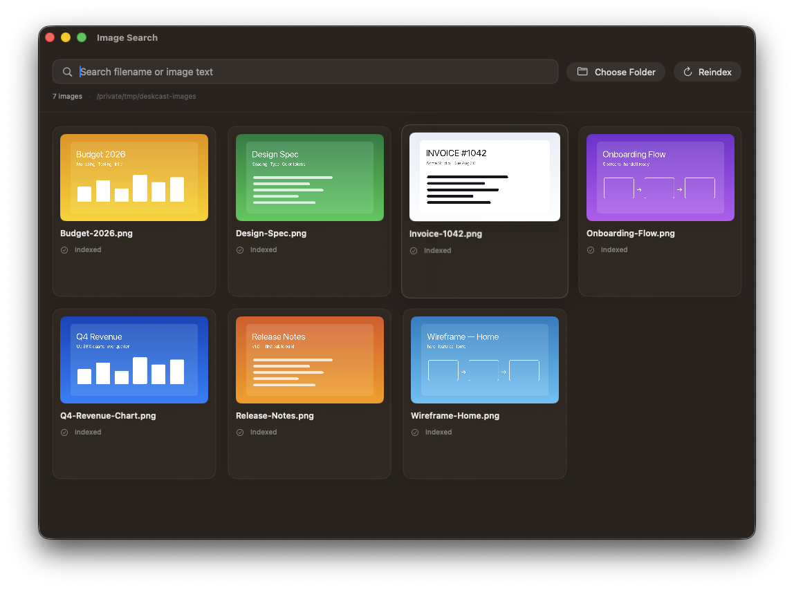</div>

## Download & install

1. Grab the latest notarized build:
   **[Download DeskCast.dmg](https://github.com/ahmetbugraozcan/DeskCast/releases/latest/download/DeskCast.dmg)**
2. Open the `.dmg` and drag **DeskCast** onto **Applications**.
3. Launch it — DeskCast appears in the menu bar (there is no Dock icon).

The app is signed with a Developer ID certificate and notarized by Apple, so it opens
cleanly on any Mac — no Gatekeeper workarounds needed.

Installed builds check the signed update feed automatically. You can also trigger a
check at any time from **Settings → About DeskCast → Check for Updates…**.

<div align="center">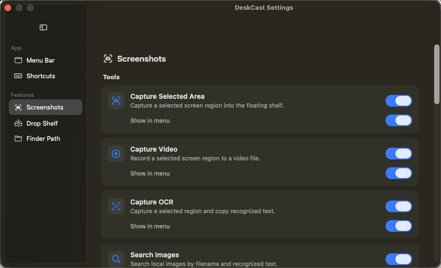</div>

## Build from source

```bash
xcodebuild -project screenshotapp.xcodeproj -scheme screenshotapp -configuration Debug -destination 'platform=macOS' build
```

Or open `screenshotapp.xcodeproj` in Xcode and run the `screenshotapp` scheme. Run the
tests with:

```bash
xcodebuild -project screenshotapp.xcodeproj -scheme screenshotapp -destination 'platform=macOS' test
```

**Requirements:** macOS (Apple Silicon or Intel) and Xcode with a matching macOS SDK.
The deployment target is set in `screenshotapp.xcodeproj`.

## Permissions

DeskCast asks for standard macOS permissions only when a feature needs them: **Screen
Recording** (capture / OCR / video), **Microphone** (optional recording audio),
**Automation → Finder** (copy path), **Accessibility** (shake-to-open, mirrored
notifications, clipboard paste), **System Audio Recording** (per-app volume), and
**Calendar / Camera / Bluetooth** for the matching island panels. It is
distributed outside the Mac App Store (Developer ID / notarized), so it is not sandboxed.

## Architecture

DeskCast is a SwiftUI + AppKit app organized as a layered, feature-module MVVM codebase:

```
screenshotapp/
  App/       @main app, AppDelegate, AppEnvironment (composition root / DI)
  Core/      cross-cutting: localization, shared UI, support helpers, ShelfCollecting
  Features/  ScreenshotShelf · Annotation · ScreenRecording · VideoEditing ·
             ScrollingCapture · ColorPicker · DropShelf · ImageSearch · DynamicIsland ·
             Permissions · Settings · Toolbox
             each split into Model / ViewModel / View / Service / Presentation
```

- **View models** (`*ViewModel`) are `@MainActor ObservableObject`s that hold state and
  orchestrate services. They depend on **protocols**, not concrete services.
- **Services** wrap OS integrations (screen capture, ScreenCaptureKit recording, Vision
  OCR, export, Finder) behind protocols so they can be faked in tests.
- **`AppEnvironment`** is the composition root: it builds the view models, injects their
  dependencies, and owns the presentation coordinators — no singletons.
- **Presentation coordinators** own the AppKit `NSPanel` lifecycle; view models drive
  them through `*Presenting` protocols instead of touching AppKit directly.

See [CLAUDE.md](CLAUDE.md) and [AGENTS.md](AGENTS.md) for deeper notes.

## Contributing

Contributions are welcome — see [CONTRIBUTING.md](CONTRIBUTING.md).

## License

[MIT](LICENSE) © 2026 Ahmet Buğra Özcan
